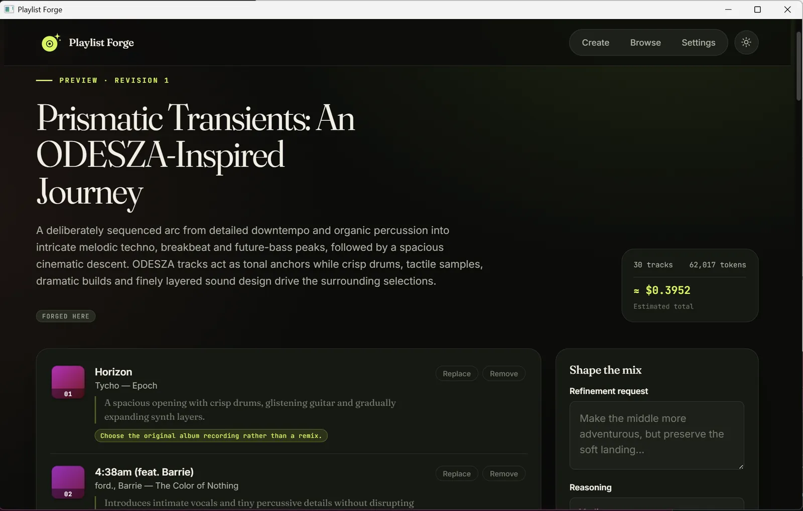

# Playlist Forge

**Turn a sentence into a researched playlist, review every track, and hand it to your streaming service.**

Playlist Forge is a local, single-user desktop application. You describe the
playlist you want; it uses OpenAI's Responses API (`gpt-5.6-sol`) with web search
to assemble a coherent, intentionally ordered tracklist of real recordings. You
review and revise it track by track, then generate a temporary
[Soundiiz](https://soundiiz.com) import link to transfer it to TIDAL, Qobuz,
Spotify, Apple Music, or another service Soundiiz supports.

The React/TypeScript interface is embedded in a single Go binary that runs on the
operating system's native webview. There is no server, no bundled runtime, and no
database service — just an executable and a local SQLite file.

<p align="center">
  
</p>

---

## Highlights

- **Prompt to playlist.** A natural-language brief becomes a titled, ordered
  playlist of 20–100 tracks, each with a rationale and recording/version notes.
- **Every edit is a revision.** Remove a track, request a single replacement, or
  refine the whole playlist with another prompt. Nothing is overwritten; every
  revision stays browsable.
- **Bring your own playlists.** Connect TIDAL or Qobuz in Settings to mirror the
  playlists you already have. Imports are read-only snapshots you can browse, use
  as inspiration for a new brief, or hand to Soundiiz — never written back to the
  service. Playlist Forge re-checks the connections in the background and prompts
  you to reconnect if one expires.
- **Grounded, not guessed.** The model is instructed to verify tracks and
  requested versions with web search and to avoid invented recordings.
- **Transparent cost.** Each request shows an estimated USD cost derived from
  reported token and web-search usage against a versioned rate card.
- **Private by default.** The OpenAI key lives in your OS credential store; it is
  never written to the playlist database and never returned to the frontend.
  Soundiiz receives only titles and artist names — never streaming credentials.
- **Local-first.** No account, no telemetry, no network listener. Data lives in
  your OS-standard application directory.

## How it works

1. **Describe** the playlist, pick a track count and reasoning effort, and
   optionally pick earlier playlists — generated here or imported from a
   streaming service — as inspiration from **Browse**.
2. **Generate.** Playlist Forge researches and orders the tracklist, then shows
   the title, description, per-track rationale, and cost estimate.
3. **Revise.** Remove, replace, or refine. Each operation writes an immutable
   local revision.
4. **Hand off.** Create a Soundiiz import link and complete the transfer on
   Soundiiz, which performs catalog matching and writes to your streaming
   service.

See [`ARCHITECTURE.md`](ARCHITECTURE.md) for package responsibilities, security
invariants, and the files that must change together when an API or persisted
model evolves.

## Install

Download the build for your platform and launch **Playlist Forge**. It opens its
own window and does not listen on a network port. Every platform is built for
both x86-64 and ARM64.

| Platform | Artifact | Notes |
| --- | --- | --- |
| Windows | `playlist-forge-<version>-windows-<arch>-setup.exe` | NSIS installer for x64 or ARM64; suitable for Winget. |
| Windows (portable) | `playlist-forge-<version>-windows-<arch>.exe` | The standalone application. No installation — download and run it. |
| macOS | `playlist-forge.app` (universal) | Intel and Apple Silicon in one bundle. |
| Linux | `.deb`, `.rpm`, `.AppImage` (per architecture) | Needs GTK 4 and WebKitGTK 6.0 (Ubuntu 24.04+, Fedora 38+, Debian 13+); the `.deb`/`.rpm` declare this. The `.AppImage` is portable. |

Release builds are currently unsigned. Configure Windows code-signing and an
Apple Developer ID / notarization identity before distributing them as a
warning-free public release.

### Opening the unsigned macOS build

Because the build is not signed with an Apple Developer ID or notarized,
Gatekeeper blocks the first launch — macOS says Playlist Forge "cannot be opened
because Apple cannot check it for malicious software", or that the app is
"damaged and can't be opened". This is expected for an unsigned app. Clear it
once per download with either method:

**System Settings (recommended).** Double-click `playlist-forge.app` and dismiss
the warning. Open **System Settings → Privacy & Security**, scroll to the
Security section, and click **Open Anyway** next to the Playlist Forge message,
confirming with Touch ID or your password. Launch the app again and click
**Open**. (On macOS 14 and earlier you can instead Control-click the app in
Finder and choose **Open**; macOS 15 removed that shortcut, so use Privacy &
Security there.)

**Terminal.** Remove the quarantine attribute the download added, then open the
app normally:

```sh
xattr -dr com.apple.quarantine /path/to/playlist-forge.app
```

Use `xattr -cr` instead if `-dr` reports the attribute is missing on some files
inside the bundle.

Signing and notarization will remove this step in a later release. Background:
Apple's [Safely open apps on your Mac](https://support.apple.com/en-us/102445).

## First run: connect an OpenAI API key

Open **Settings**, paste a key into **API key**, and choose **Save key**.
Playlist Forge validates that the key can access `gpt-5.6-sol` before storing it.

To create a key:

1. [Create an OpenAI Platform account or sign in](https://platform.openai.com/signup).
2. Open [Billing settings](https://platform.openai.com/settings/organization/billing/overview)
   and add a payment method or credits. API calls are billed by usage.
3. On the [API keys page](https://platform.openai.com/api-keys), choose **Create
   new secret key**, name it (e.g. `Playlist Forge`), and copy the value.
4. Paste it into Playlist Forge and save.

Treat the key like a password: never share it, commit it, put it in a screenshot,
or paste it into an untrusted page. You can revoke it from the API keys page at
any time.

### Where the key is stored

`OPENAI_API_KEY`, if set, takes precedence and is shown in Settings as a
read-only, environment-managed credential. Otherwise Playlist Forge uses the OS
credential store — Windows Credential Manager, macOS Keychain, or the Linux
Secret Service. If that store is unavailable, Settings offers an explicit opt-in
to a permission-restricted `config.json` fallback in the application directory.
The key is never written to `playlists.db`.

## Import your existing playlists

Playlist Forge can mirror the playlists you already own on a streaming service so
you can browse them, draw on them as inspiration, or hand them to Soundiiz. This
is optional and needs no OpenAI usage.

1. Open **Settings > Streaming connections** and choose **Connect** next to TIDAL
   or Qobuz.
   - **TIDAL** approves in your real browser: a TIDAL verification page opens
     with a short code, you confirm there, and the app finishes automatically.
     If no browser opens, the URL is written to the log for you to open by hand.
   - **Qobuz** signs in inside a small embedded window.

   Sign in with the exact method that owns the library you want — Google, Apple,
   Facebook, and email/password logins can resolve to different profiles on the
   same address.
2. Open **Browse**. Imported playlists appear grouped by origin — *Forged here*,
   then *TIDAL*, then *Qobuz* — each row showing its track count and a badge for
   every place it lives. Open one to preview its tracks.
3. Use **Reload TIDAL** / **Reload Qobuz** in Browse to refresh the mirror. It
   runs as a cancellable background job with progress: new playlists are added,
   changed ones re-fetched, and playlists deleted upstream are removed. A
   streaming playlist whose contents match one you forged here is folded into
   that record rather than listed twice.

Imported playlists are **read-only snapshots**. Playlist Forge never writes to
your streaming account — it only reads playlist and track metadata. Credentials
live only in your OS credential store (with the same file fallback as the OpenAI
key), never in `playlists.db`.

Connections are re-checked in the background (shortly after launch and every few
minutes). If a session has expired or been revoked, a banner and the Settings
row prompt you to **Reconnect**; your imported playlists are kept. A transient
outage of TIDAL, Qobuz, or Soundiiz surfaces as "*… is not available right now.
Please try again later.*" — retry the action after a moment.

## Using Playlist Forge

1. Describe the playlist, choose 20 / 30 / 40 / 50 / 60 / 100 tracks, and select
   a reasoning effort (Medium is the default; higher efforts take longer).
2. Optionally open **Browse** and select any earlier playlists — generated here
   or imported from a streaming service — to seed the brief. They appear as
   removable chips on the composer.
3. Review the generated title, description, ordering, recording and version
   notes, and per-track rationale.
4. Remove tracks, request individual replacements, or refine the whole playlist
   with another prompt. Each operation creates an immutable local revision.
5. From the playlist preview, choose **Open Soundiiz handoff** to create a
   temporary public import link (valid for roughly 24 hours).

Soundiiz receives only the accepted playlist title, description, track titles,
and artist names. Playlist Forge never receives your streaming credentials.

## Completing a transfer with Soundiiz

Playlist Forge prepares a temporary import page; Soundiiz handles authorization
and writes the playlist to the streaming service.

### One-time setup

1. Sign in to the destination streaming service (in its own app or website) on
   the exact profile where the playlist should be created. Some services require
   a paid subscription for third-party playlist writes.
2. [Create a Soundiiz account](https://soundiiz.com/register) or sign in. Use a
   consistent sign-in method so you do not create a second Soundiiz account.
3. In Soundiiz, open the left panel, select the streaming service (or **Connect
   more services**), choose **Connect**, and complete its authorization screen.
   The icon turns green on success. Manage connections later under **Settings >
   Platforms**. See the
   [Soundiiz connection guide](https://support.soundiiz.com/hc/en-us/articles/360024694393-How-to-connect-your-music-accounts-to-Soundiiz).
4. Check the service-specific prerequisite:

   | Service | Before authorizing Soundiiz |
   | --- | --- |
   | TIDAL | Use the same TIDAL sign-in method that owns the intended library. Google, Apple, Facebook, and email/password sign-ins can resolve to different TIDAL profiles even with a shared email address. |
   | Qobuz | Sign in to the intended Qobuz account in the same browser first. To switch accounts, disconnect Qobuz under **Settings > Platforms**, sign out, sign in to the other account, and reconnect. |
   | Spotify | Approve Soundiiz's playlist read/write permissions. If Spotify later expires the grant, reconnect under **Settings > Platforms** and retry. |
   | Apple Music | Use the Apple Account with an active Apple Music subscription, enable **Sync Library**, and allow pop-ups and cookies during authorization. See the [Apple Music checklist](https://support.soundiiz.com/hc/en-us/articles/360009609854-I-can-t-connect-my-Apple-Music-account). |

### Each transfer

1. In Playlist Forge, accept the playlist and choose **Open Soundiiz handoff**.
2. Sign in to Soundiiz if prompted. Review the imported title and tracks,
   inspect the catalog matches, and correct or skip any mismatch.
3. Select the connected destination account and start the transfer. When
   Soundiiz reports completion, open the streaming service and verify the
   playlist and track versions.
4. To send the same playlist elsewhere, connect and select that service in
   Soundiiz. Create a fresh handoff from Playlist Forge only if the link has
   expired.

The free Soundiiz plan supports one transfer at a time of up to 200 tracks,
which covers Playlist Forge's 100-track maximum; see
[Soundiiz plans](https://soundiiz.com/pricing) for current limits. Catalogs vary
by service and region, so a track may be unavailable or resolve to a different
edition.

## Cost estimates

Each request's preview shows an estimated cost derived from reported input,
cached-input, output, reasoning, and web-search usage. The embedded rate card is
versioned `2026-09-01`: `$4.00` / M input tokens, `$0.40` / M cached input
tokens, `$20.00` / M output tokens, and `$0.01` per web-search call.
Search-result content counts toward input tokens.

This is an estimate, not an invoice. Prices change, long-context or regional
processing may use different rates, and credits or discounts are not reflected.
Your OpenAI dashboard is authoritative.

## Building from source

**Requirements:** Go 1.27+ (matching `go 1.27` in `go.mod`), Node.js 24,
pnpm 11.19, and — on Linux — a C toolchain plus the GTK 4 / WebKitGTK 6.0
development headers (CGO is required for the webview).

### Ubuntu 24.04

```sh
# System build dependencies
sudo apt-get update
sudo apt-get install -y build-essential pkg-config git curl \
  libgtk-4-dev libwebkitgtk-6.0-dev

# Go — Ubuntu's package is older than 1.27, so install the official tarball.
# Set GO_VERSION to the current 1.27.x from https://go.dev/dl/.
GO_VERSION=1.27.0
curl -fsSL "https://go.dev/dl/go${GO_VERSION}.linux-$(dpkg --print-architecture).tar.gz" \
  | sudo tar -C /usr/local -xz
export PATH="$PATH:/usr/local/go/bin"   # add to ~/.profile to persist

# Node.js 24 (Ubuntu ships 18) and pnpm 11.19, via corepack
curl -fsSL https://deb.nodesource.com/setup_24.x | sudo -E bash -
sudo apt-get install -y nodejs
corepack enable && corepack prepare pnpm@11.19.0 --activate
```

Then:

```sh
git clone https://github.com/platten/playlistforge.git
cd playlistforge
bash scripts/build-desktop.sh   # runs the quality gate, then writes
                                # .deb, .rpm, and .AppImage to build/bin
```

`scripts/build-desktop.sh` installs the frontend dependencies and builds the
embedded UI itself; `curl` and `sha256sum` (from `coreutils`) are the only other
tools the Linux packaging step needs. Fedora is analogous with `gcc`,
`pkg-config`, `gtk4-devel`, and `webkitgtk6.0-devel`.

This is a [Wails v3](https://v3.wails.io) application. Wails v3 embeds the built
frontend with a plain `//go:embed`, so a build is: build the frontend, then
`go build`. There is no `wails build` step.

Run the desktop build for the current OS:

```sh
bash scripts/build-desktop.sh          # macOS / Linux
pwsh -File scripts/build-desktop.ps1   # Windows
```

Artifacts land in `build/bin`. On Linux the build targets the host architecture
and produces the `.deb`, `.rpm`, and `.AppImage`; macOS produces the universal
`playlist-forge.app`; Windows cross-compiles both architectures and produces
the standalone `playlist-forge-<arch>.exe` plus NSIS installers with silent
`/S` install and uninstall support (the release job also publishes the exe as
`playlist-forge-<version>-windows-<arch>.exe`). Pass `-SkipInstaller` when NSIS
packaging is not needed. The product version comes
from the `VERSION` file. `build/appicon.svg` is the icon
master; `build/appicon.png`, `build/darwin/icons.icns`, and
`build/windows/icon.ico` are generated from it.

For an iteration loop without packaging:

```sh
pnpm --dir web run build
CGO_ENABLED=1 go run .   # Linux (GTK4 / WebKitGTK 6.0)
go run .                # macOS / Windows
```

## Development and testing

`scripts/test.sh` (Bash) and `scripts/test.ps1` (PowerShell) are the canonical
quality gate. Each installs the locked frontend dependencies and runs the full
frontend and Go checks — formatting, linting, type-checking, unit tests, the Go
race detector (when CGO is available on Linux or macOS), and the embedded
frontend build — then enforces coverage thresholds.

```sh
bash scripts/test.sh
pwsh -File scripts/test.ps1
```

Pass `--skip-tests` / `-SkipTests` to a build script only when the matching test
script has already passed for the same source state.

The individual commands, for troubleshooting a single stage:

```sh
# Go
gofmt -l main.go internal
go vet ./...
go test -race ./...

# Frontend (from web/)
pnpm run format:check
pnpm run lint
pnpm run typecheck
pnpm test
pnpm run build
```

**Coverage.** CI requires ≥ 95% statement coverage across the business and
external-boundary packages (`app`, `playlist`, `openaiapi`, `soundiiz`). The
frontend adapter, job polling, and delayed-overlay logic are held to 95% for
statements, branches, functions, and lines; page-level tests additionally cover
rendering and XSS-safe handling of user text.

**Releases.** Pushing a `v*` tag runs `.github/workflows/release.yml`: it writes
the tag version to `VERSION`, builds the native Linux, Windows, and macOS
artifacts (Linux on both an x86-64 and an ARM64 runner), writes
`SHA256SUMS.txt`, and creates or updates the GitHub Release.

## Security

- The OpenAI base URL is fixed to `https://api.openai.com/v1`; no environment
  variable can redirect it.
- The Soundiiz endpoint is fixed to `https://soundiiz.com/go/import-playlist`.
  Redirects are not followed, and a returned handoff URL must use the exact
  HTTPS Soundiiz host and documented path or it is rejected.
- User text is rendered without raw HTML. The desktop API validates every
  external URL before opening it and validates domain input before any paid or
  persisted operation.
- Model instructions are a trusted policy boundary; user prompts and stored
  playlists are supplied as data and cannot override them.
- Console logs redact OpenAI-key-shaped values. Prompts and tracklists are
  logged only at debug level.
- `OPENAI_API_KEY` is read at runtime, never returned to the frontend, and
  cannot be changed or removed through the interface while it is set.
- Streaming connections are read-only: Playlist Forge reads playlist and track
  metadata from TIDAL and Qobuz and never writes to those accounts. Their
  session tokens are stored beside the OpenAI key (OS credential store, or the
  opt-in restricted file) and are never written to `playlists.db` or returned to
  the frontend.

## Troubleshooting

| Symptom | Resolution |
| --- | --- |
| Credential store unavailable | Enable the config-file fallback in Settings, or configure Keychain / Credential Manager / Secret Service. |
| OpenAI validation failed | Confirm the key is active, billing is enabled, and the project can access `gpt-5.6-sol`. |
| Operation is slow | After three seconds the app shows live progress and a Cancel button. Higher efforts and larger playlists take longer. |
| Soundiiz link expired | Create a fresh handoff from the saved playlist preview. |
| Streaming session expired | Open **Settings** (or use the banner) and choose **Reconnect** for that service. Imported playlists are kept; Browse shows **Reconnect** in place of **Reload** until you do. |
| "… is not available right now" | A transient TIDAL, Qobuz, or Soundiiz outage. Wait a moment and retry the Reload or handoff; the connection itself is still fine. |
| macOS won't open the app ("damaged" / "cannot be checked") | Expected for the unsigned build. See [Opening the unsigned macOS build](#opening-the-unsigned-macos-build). |

## License

Playlist Forge is distributed under the MIT License; see [`LICENSE`](LICENSE).
Copyright © 2026 Paul Pietkiewicz.
